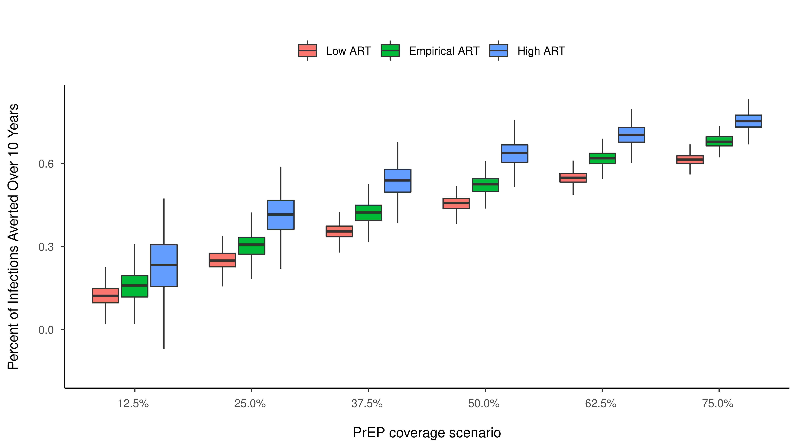

# Population Impact and Efficiency of Improvements to HIV PrEP Under Conditions of High ART Coverage among San Francisco Men Who Have Sex with Men

This repository holds the source to code to reproduce the analysis featured in our HIV/STI transmission model evaluating the impact of COVID-related impacts on the  dynamics of HIV, gonorrhea, and chlamydia.

## Citation

> Adrien Le Guillou, Susan Buchbinder, Hyman Scott, Albert Liu, Diane Havlir, Susan Scheer, Samuel M. Jenness. Population Impact and Efficiency of Improvements to HIV PrEP Under Conditions of High ART Coverage among San Francisco Men Who Have Sex with Men. _MedArxiv_. [[Pre-Print]](https://doi.org/10.1093/infdis/jiab051)



## Abstract

#### Background

Key components of Ending the HIV Epidemic (EHE) plan include increasing HIV antiretroviral therapy (ART) and HIV preexposure prophylaxis (PrEP) coverage. One complication to addressing this service delivery challenge is the wide heterogeneity of HIV burden and healthcare access across the U.S. It is unclear how the effectiveness and efficiency of expanded PrEP will depend on different baseline ART coverage.

#### Methods

We used a network-based model of HIV transmission for men who have sex with men (MSM) in San Francisco. Model scenarios increased varying levels of PrEP coverage relative under current empirical levels of baseline ART coverage and two counterfactual levels. We assessed the effectiveness of PrEP with the cumulative percent of infections averted (PIA) over the next decade and efficiency with the number needed to treat (NNT) by PrEP required
to avert one HIV infection.

#### Results

In our projections, only the highest levels of combined PrEP and ART coverage achieved the EHE goals. Increasing PrEP coverage up to 75% showed that PrEP effectiveness was higher at higher baseline ART coverage with the PIA ranging from 61% in the lowest baseline ART coverage population to 75% in the highest ART coverage. The efficiency declined with increasing ART (NNT range from 41 to 113).

#### Conclusions

Improving both PrEP and ART coverage would have a synergistic impact on HIV prevention even in a high baseline coverage city like San Francisco. Efforts should focus on narrowing the implementation gaps to achieve higher levels of PrEP retention and ART sustained viral suppression.

## Model Code

These models are written and executed in the R statistical software language. To run these files, it is necessary to use the correct version of our epidemic modeling software, [EpiModel](http://epimodel.org/), and our extension package specifically for modeling HIV/STI transmission dynamics among MSM,
[EpiModelHIV](http://github.com/statnet/EpiModelHIV).

In R, load the necessary packages with the following command:

```
install.packages("renv")
renv::init()
```

Once `renv` has finished initializing, restart R.

### ARTnet Data Access

To use this model, you will need a GitHub Private Access Token to install packages from private GitHub repositories (EpiModelHIV-p, ARTNetData). It should be set either in "~/.bashrc":

```
export GITHUB_PAT="<your github private access token>"
```

or in "~/.Renviron":

```
GITHUB_PAT="<your github private access token>"
```
